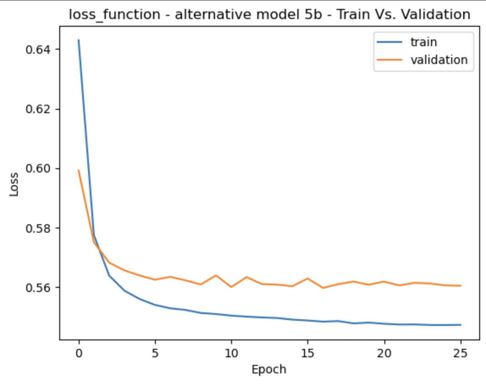
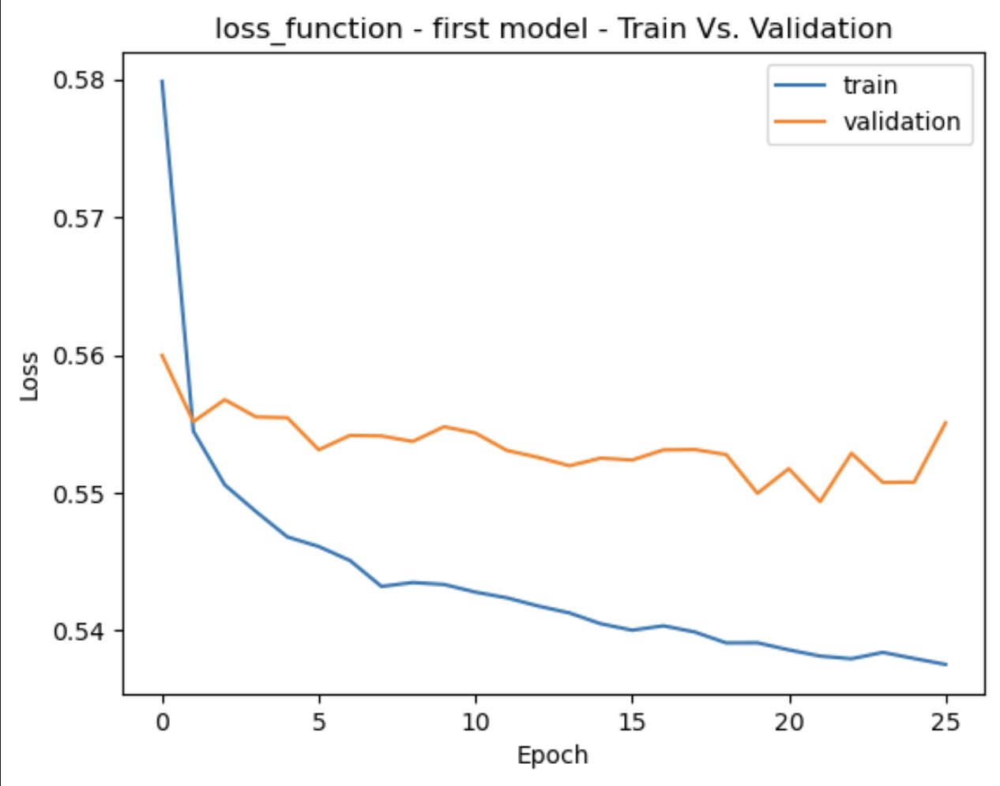
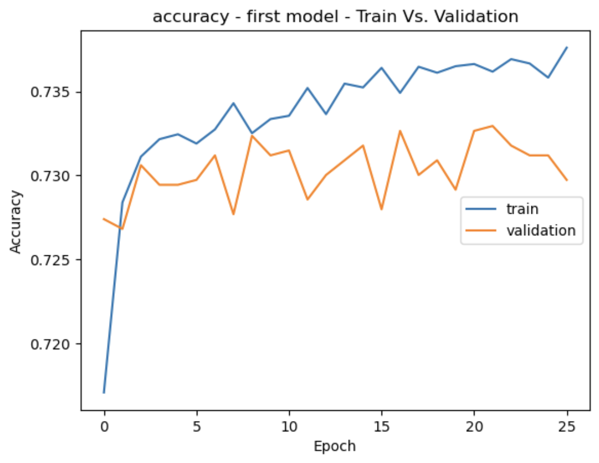
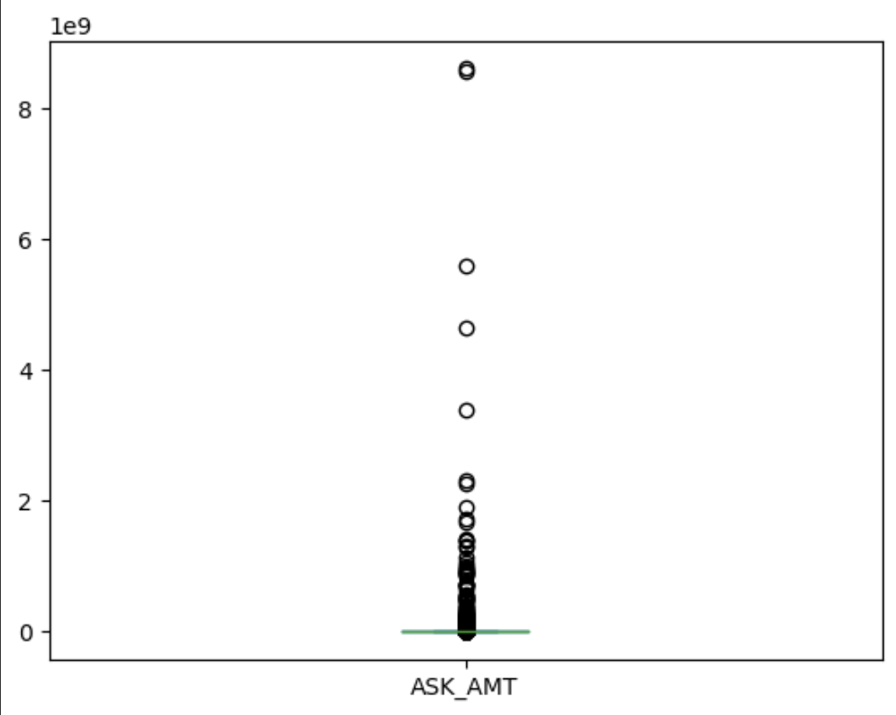
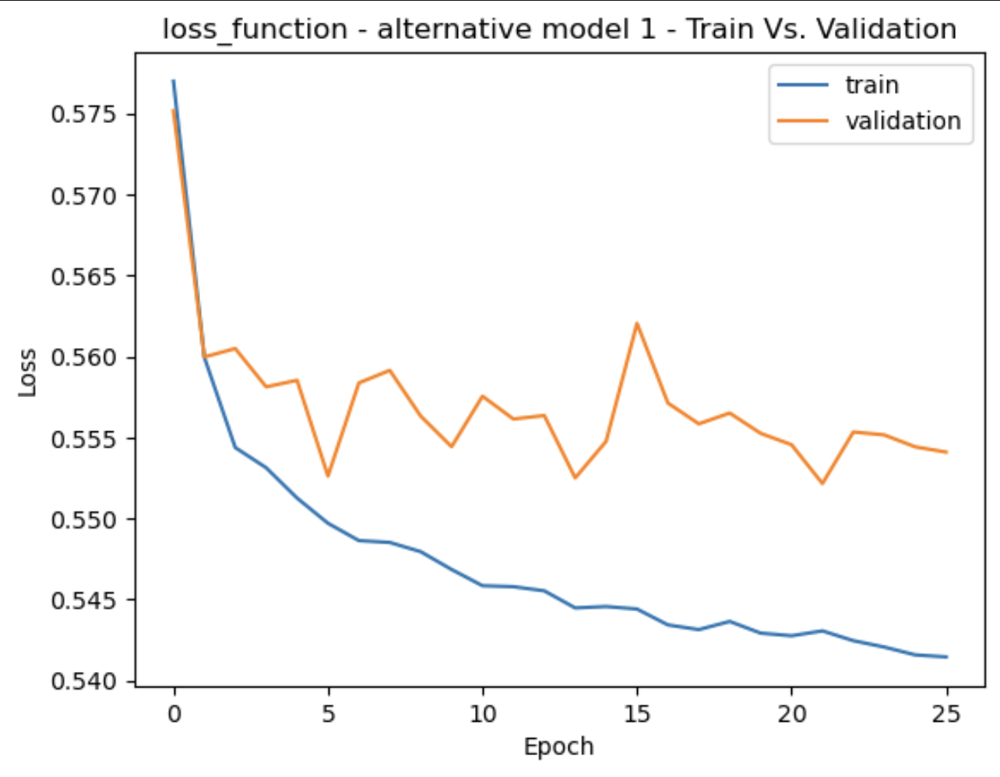
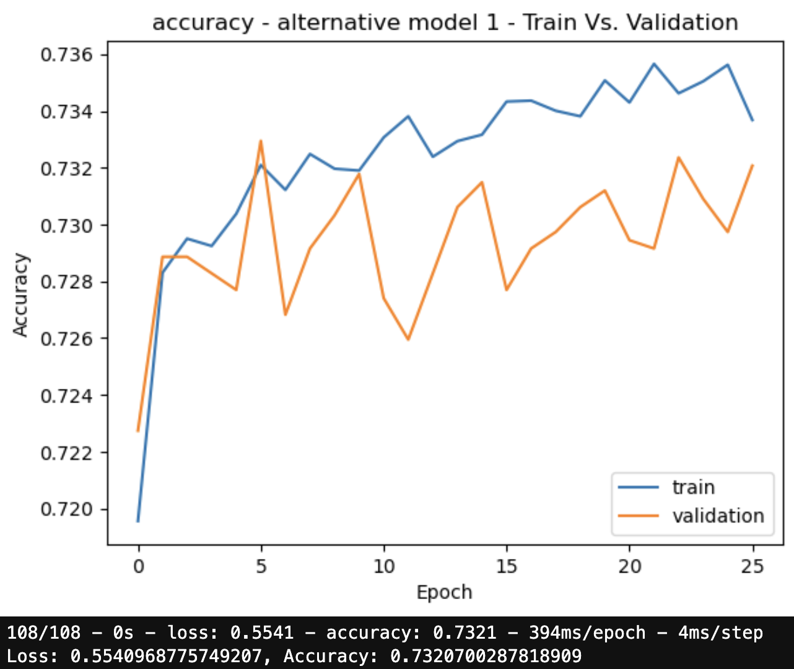
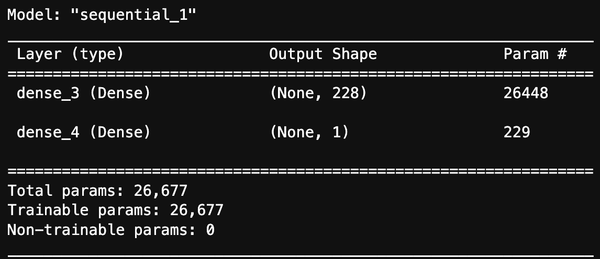
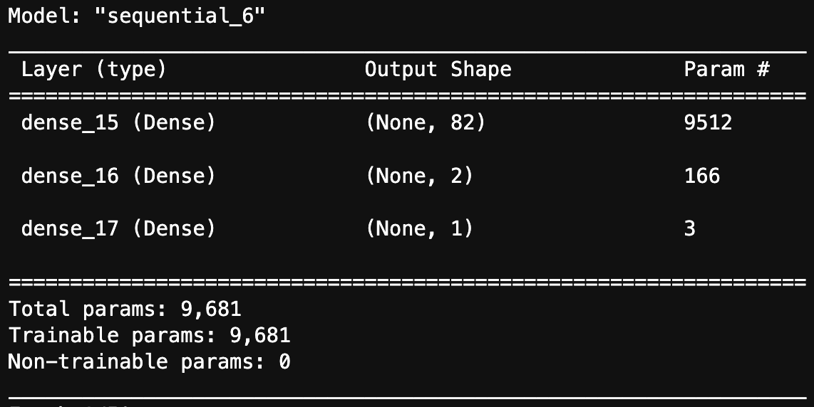
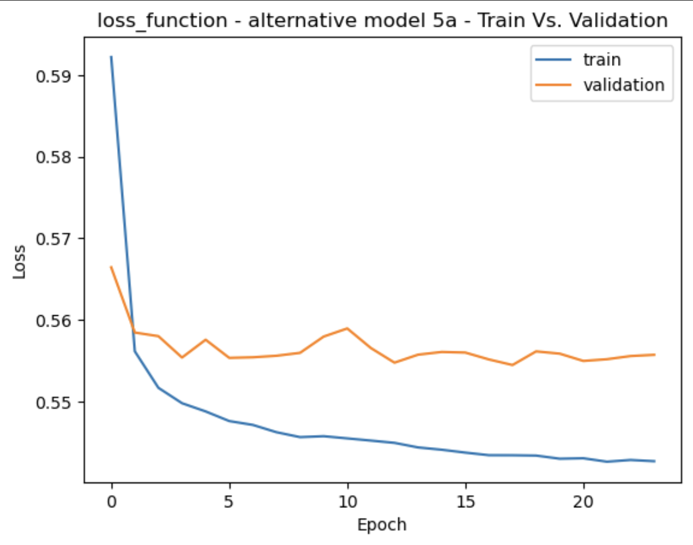
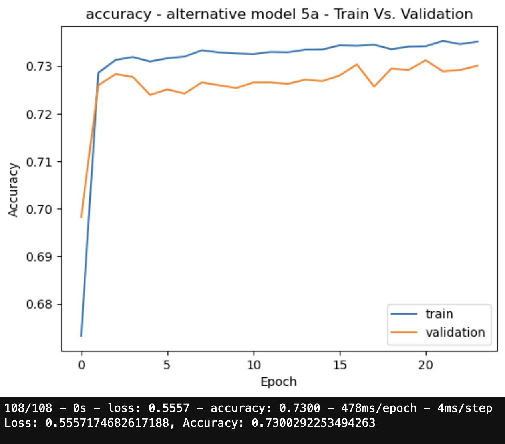

# **Columbia University Engineering, New York FinTech BootCamp** 
# **August 2022 Cohort**


## *Module 12, Challenge -  Data Science & Machine Learning - Supervised Learning*
Objective - use various techniques to train and evaluate supervised learning models with imbalanced classes to identify the creditworthiness of credit applicants. 

Scenario - Given a dataset of historical lending activity from a peer-to-peer lending services company, use your knowledge of the imbalanced-learn library with a logistic regression model to compare two versions (imbalanced vs resampled) of the dataset and build a model that can identify the creditworthiness of borrowers.  

Product - Jupyter notebook with both data set versions providing the count of the 'target' classes, train a logistic regression classifier, calculate the balanced accuracy score, generate a confusion matrix, and generate a classification report.

---
## **Methods**
### The code script analysis performed uses or employs applications of:

    PCA, 
    Feature Scaling with StandardScaler,
    train_test_split,
    random undersampling,
    random oversampling,
    SMOTEENN resampling,
    K-Means (KMeans) 2 and 3 cluster modeling,
    KN regression (KNeighborsRegressor) modeling,
    KNeighborsClassifier analysis modeling,
    random forest (RandomForestClassifier) modeling,
    logistic regression (LogisticRegression) modeling,
    confusion matrices,
    balanced_accuracy scores,
    imbalanced classification reports, 
    HV scatter plot,
    seaborn heatmaps

___
## Primary Challenge - Modeling & Analysis
### Original Logistic Regression Analysis on original imbalanced data


### Original Logistic Regression Analysis on original imbalanced data after Random Oversampling



___
## Supplemental Modeling and Analysis

Supplemental processing and analysis:

Beyond the scope of the assignment, the author sought to conduct additional analysis of the data obtained; supplemental material script precedes the primary assignment. 
___

### Original imbalanced data Modeling Analysis with -
    Feature Scaling with StandardScaler,
    Calculated Best K for KNeighborsClassifier through maximum f1,
    KNN for Classification.
    
    



___

### Original imbalanced data Modeling Analysis with -
    Feature Scaling with StandardScaler,
    Calculated Best K for KN Regression (KNeighborsRegressor) through minimum MAE,
    KNN Regression.
    
    





___

### Original imbalanced data Modeling Analysis with -
    Random undersampling (RandomUnderSampler),
    RandomForestClassifier
    
    

___

### Original imbalanced data Modeling Analysis with -
    Random oversampling (RandomOverSampler),
    RandomForestClassifier
 
    

___

### Original imbalanced data Modeling Analysis with -
    Feature Scaling with StandardScaler,
    SMOTEENN resampling,
    RandomForestClassifier
 
    


---
## **Technologies**
---
### **Dependencies**

This project leverages Jupyter Lab v3.4.4 and Python version 3.9.13 (main, Oct 13 2022, 16:12:30) with the following packages:


* [sys](https://docs.python.org/3/library/sys.html) - module provides access to some variables used or maintained by the interpreter and to functions that interact strongly with the interpreter.

* [NumPy](https://numpy.org/doc/stable/user/absolute_beginners.html) - an open source Python library used for working with arrays, contains multidimensional array and matrix data structures with functions for working in domain of linear algebra, fourier transform, and matrices.

* [pandas](https://pandas.pydata.org/docs/) - software library written for the python programming language for data manipulation and analysis.

* [Path](https://pandas.pydata.org/docs/reference/api/pandas.concat.html) - from pathlib - Object-oriented filesystem paths, Path instantiates a concrete path for the platform the code is running on.

* [train_test_split](https://scikit-learn.org/stable/modules/generated/sklearn.model_selection.train_test_split.html) - from sklearn.model_selection, a quick utility that wraps input validation and next(ShuffleSplit().split(X, y)) and application to input data into a single call for splitting (and optionally subsampling) data in a oneliner.

* [cross_val_score](https://scikit-learn.org/stable/modules/generated/sklearn.model_selection.cross_val_score.html) - from sklearn.model_selection, evaluates a score by cross-validation.

* [LogisticRegression](https://scikit-learn.org/stable/modules/generated/sklearn.linear_model.LogisticRegression.html) - from sklearn.linear_model, a Logistic Regression (aka logit, MaxEnt) classifier; implements regularized logistic regression using the ‘liblinear’ library, ‘newton-cg’, ‘sag’, ‘saga’ and ‘lbfgs’ solvers - regularization is applied by default.

* [RandomForestClassifier](https://scikit-learn.org/stable/modules/generated/sklearn.ensemble.RandomForestClassifier.html) - from sklearn.ensemble, a random forest classifier; a meta estimator that fits a number of decision tree classifiers on various sub-samples of the dataset and uses averaging to improve the predictive accuracy and control over-fitting.

* [confusion_matrix](https://scikit-learn.org/stable/modules/generated/sklearn.metrics.confusion_matrix.html) - from sklearn.metrics, computes confusion matrix to evaluate the accuracy of a classification; confusion matrix *C* is such that *Cij* is equal to the number of observations known to be in group *i* and predicted to be in group *j*.

* [balanced_accuracy_score](https://scikit-learn.org/stable/modules/generated/sklearn.metrics.balanced_accuracy_score.html) - from sklearn.metrics, compute the balanced accuracy in binary and multiclass classification problems to deal with imbalanced datasets; defined as the average of recall obtained on each class.

* [f1_score](https://scikit-learn.org/stable/modules/generated/sklearn.metrics.f1_score.html) - from sklearn.metrics, computes the F1 score, also known as balanced F-score or F-measure; can be interpreted as a harmonic mean of the precision and recall, where an F1 score reaches its best value at 1 and worst score at 0.

* [mean_absolute_error](https://scikit-learn.org/stable/modules/generated/sklearn.metrics.mean_absolute_error.html) - from sklearn.metrics, mean absolute error regression loss.

* [RandomOverSampler](https://imbalanced-learn.org/stable/references/generated/imblearn.over_sampling.RandomOverSampler.html) - from imblearn.over_sampling, a class to perform random over-sampling; object to over-sample the minority class(es) by picking samples at random with replacement.

* [RandomUnderSampler](https://imbalanced-learn.org/stable/references/generated/imblearn.under_sampling.RandomUnderSampler.html) - from imblearn.under_sampling, a class to perform random under-sampling; under-sample the majority class(es) by randomly picking samples with or without replacement. 
 
* [SMOTEENN](https://imbalanced-learn.org/stable/references/generated/imblearn.combine.SMOTEENN.html) - from imblearn.combine, over-sampling using SMOTE and cleaning using ENN; combine over- and under-sampling using SMOTE and Edited Nearest Neighbours.

* [classification_report_imbalanced](https://glemaitre.github.io/imbalanced-learn/generated/imblearn.metrics.classification_report_imbalanced.html) - from imblearn.metrics, compiles the metrics: precision/recall/specificity, geometric mean, and index balanced accuracy of the geometric mean.

* [KMeans](https://scikit-learn.org/stable/modules/generated/sklearn.cluster.KMeans.html) - from sklearn.cluster, K-Means clustering.

* [PCA](https://scikit-learn.org/stable/modules/generated/sklearn.decomposition.PCA.html) - from sklearn.decomposition, principal component analysis (PCA); linear dimensionality reduction using Singular Value Decomposition of the data to project it to a lower dimensional space.

* [StandardScaler](https://scikit-learn.org/stable/modules/generated/sklearn.preprocessing.StandardScaler.html) - from sklearn.preprocessing, standardize features by removing the mean and scaling to unit variance.

* [KNeighborsRegressor](https://scikit-learn.org/stable/modules/generated/sklearn.neighbors.KNeighborsRegressor.html) - from sklearn.neighbors, a regression based on k-nearest neighbors; target is predicted by local interpolation of the targets associated of the nearest neighbors in the training set.

* [KNeighborsClassifier](https://scikit-learn.org/stable/modules/generated/sklearn.neighbors.KNeighborsClassifier.html) - from sklearn.neighbors, a classifier implementing the k-nearest neighbors vote.

* [NearestNeighbors](https://scikit-learn.org/stable/modules/generated/sklearn.neighbors.NearestNeighbors.html) - from sklearn.neighbors, a unsupervised learner for implementing neighbor searches.

* [kneighbors_graph](https://scikit-learn.org/stable/modules/generated/sklearn.neighbors.kneighbors_graph.html) - from sklearn.neighbors, computes the (weighted) graph of k-Neighbors for points in X.

* [kneighbors_graph](https://scikit-learn.org/stable/modules/generated/sklearn.neighbors.kneighbors_graph.html) - from sklearn.neighbors, computes the (weighted) graph of k-Neighbors for points in X.

* [hvplot](https://hvplot.holoviz.org/getting_started/hvplot.html) - provides a high-level plotting API built on HoloViews that provides a general and consistent API for plotting data into numerous formats listed within linked documentation.

* [matplotlib.pyplot](https://matplotlib.org/3.5.3/api/_as_gen/matplotlib.pyplot.html) a state-based interface to matplotlib. It provides an implicit, MATLAB-like, way of plotting. It also opens figures on your screen, and acts as the figure GUI manager

* [Seaborn](https://seaborn.pydata.org/tutorial/introduction) a library for making statistical graphics in Python. It builds on top of matplotlib and integrates closely with pandas data structures.

___

### **Hardware used for development**

MacBook Pro (16-inch, 2021)

    Chip Appple M1 Max
    macOS Monterey version 12.6

### **Development Software**

Homebrew 3.6.11

    Homebrew/homebrew-core (git revision 01c7234a8be; last commit 2022-11-15)
    Homebrew/homebrew-cask (git revision b177dd4992; last commit 2022-11-15)

anaconda Command line client 1.10.0

    conda 22.9.0
    Python 3.9.13
    pandas 1.5.1

pip 22.3 from /opt/anaconda3/lib/python3.9/site-packages/pip (python 3.9)


git version 2.37.2

---
## *Installation of application (i.e. github clone)*

 In the terminal, navigate to directory where you want to install this application from the repository and enter the following command

```python
git clone git@github.com:Billie-LS/give_me_cred.git
```

---
## **Usage**

From terminal, the installed application is run through jupyter lab web-based interactive development environment (IDE) interface by typing at prompt:

```python
> jupyter lab

```
The file you will run is:

```python
credit_risk_resampling.ipynb

```

___

## **Project requirements**
### see starter code

---
## **Version control**

Version control can be reviewed at:

```python
https://github.com/Billie-LS/give_me_cred
```

[repository](https://github.com/Billie-LS/give_me_cred)


___
## **Contributors**

### **Author**

Loki 'billie' Skylizard
    [LinkedIn](https://www.linkedin.com/in/l-s-6a0316244)
    [@GitHub](https://github.com/Billie-LS)


### **BootCamp lead instructor**

Vinicio De Sola
    [LinkedIn](https://www.linkedin.com/in/vinicio-desola-jr86/)
    [@GitHub](https://github.com/penpen86)


### **BootCamp teaching assistant**

Santiago Pedemonte
    [LinkedIn](https://www.linkedin.com/in/s-pedemonte/)
    [@GitHub](https://github.com/Santiago-Pedemonte)


### **BootCamp classmates**
Stratis Gavnoudias
    [LinkedIn](https://www.linkedin.com/in/stratis-gavnoudias-465b527/)
    [@GitHub](https://github.com/sgavnoudias)


### **askBCS assistants**

None
___

### **Additional references and or resources utilized**

[StackAbuse](https://stackabuse.com/k-nearest-neighbors-algorithm-in-python-and-scikit-learn/)

[Stack Overflow](https://stackoverflow.com/questions/15065833/imbalance-in-scikit-learn)

[Stack Overflow](https://stackoverflow.com/questions/48244219/is-sklearn-metrics-mean-squared-error-the-larger-the-better-negated)

*For accuracy hyperparameter analysis-*
[GitHub](https://github.com/krishnaik06/AQI-Project/blob/master/KNearestNeighborRegressor.ipynb)


___
## **License**

MIT License

Copyright (c) [2022] [Loki 'billie' Skylizard]

Permission is hereby granted, free of charge, to any person obtaining a copy
of this software and associated documentation files (the "Software"), to deal
in the Software without restriction, including without limitation the rights
to use, copy, modify, merge, publish, distribute, sublicense, and/or sell
copies of the Software, and to permit persons to whom the Software is
furnished to do so, subject to the following conditions:

The above copyright notice and this permission notice shall be included in all
copies or substantial portions of the Software.

THE SOFTWARE IS PROVIDED "AS IS", WITHOUT WARRANTY OF ANY KIND, EXPRESS OR
IMPLIED, INCLUDING BUT NOT LIMITED TO THE WARRANTIES OF MERCHANTABILITY,
FITNESS FOR A PARTICULAR PURPOSE AND NONINFRINGEMENT. IN NO EVENT SHALL THE
AUTHORS OR COPYRIGHT HOLDERS BE LIABLE FOR ANY CLAIM, DAMAGES OR OTHER
LIABILITY, WHETHER IN AN ACTION OF CONTRACT, TORT OR OTHERWISE, ARISING FROM,
OUT OF OR IN CONNECTION WITH THE SOFTWARE OR THE USE OR OTHER DEALINGS IN THE
SOFTWARE.


